<!-- AM // GITHUB PROFILE README -->
<!-- DO NOT EDIT THE RAW HTML — use scripts/generate-assets.js to regenerate SVGs -->

<div align="center">

<!-- ═══════════════════════════════════════════════
     HERO — BOOT SEQUENCE + IDENTITY REVEAL
     Animated SVG: boot sequence → glitch → identity lock
════════════════════════════════════════════════ -->



</div>

---

<!-- ═══════════════════════════════════════════════
     WHOAMI + STACK TERMINAL
════════════════════════════════════════════════ -->

<div align="center">


</div>

<br/>

> CSE student building production-grade systems at the intersection of AI, automation, and full-stack engineering.
> Focused on shipping things that actually work.

---

<!-- ═══════════════════════════════════════════════
     PROJECTS — ANIMATED TERMINAL CAROUSEL
════════════════════════════════════════════════ -->

<div align="center">



</div>

<br/>

<!-- ═══════════════════════════════════════════════
     STATIC PROJECT GRID
     (for visitors who want to scan quickly)
════════════════════════════════════════════════ -->

<table width="100%">
<tr>

<td width="33%" valign="top">

```
┌── DeepTrace ───────────────────┐
```

Sports image reuse detection system.
Reverse-searches images across the web
and flags repurposed media using AI.

```
Tech ──────────────────────────────
Firebase · Firestore · Cloudinary
SerpAPI · Gemini · QStash
```

[→ github.com/sohamparanjape12/DeepTrace](https://github.com/sohamparanjape12/DeepTrace)

</td>

<td width="33%" valign="top">

```
┌── ResQSampark ─────────────────┐
```

Real-time emergency response platform
for coordinating field units and
command centres under pressure.

```
Tech ──────────────────────────────
Next.js · Supabase · WebSockets
```

[→ github.com/AarushM142/ResqSampark](https://github.com/AarushM142/ResqSampark)

</td>

<td width="33%" valign="top">

```
┌── MetrologyEye ────────────────┐
```

Detects Packaged Commodities Rules
violations from product label images
using computer vision and OCR.

```
Tech ──────────────────────────────
Python · OpenCV · PaddleOCR
```

[→ github.com/AarushM142/MetrologyEye](https://github.com/AarushM142/MetrologyEye)

</td>

</tr>
</table>

---

<!-- ═══════════════════════════════════════════════
     GITHUB ACTIVITY
════════════════════════════════════════════════ -->

<div align="center">

```
[ SYS ] SYNCING GITHUB...
```


<br/>


</div>

---

<!-- ═══════════════════════════════════════════════
     CONTACT
════════════════════════════════════════════════ -->

<div align="center">


<br/>

<a href="https://github.com/AarushM142"></a>&nbsp;&nbsp;
<a href="https://www.linkedin.com/in/aarush-majumdar/"></a>&nbsp;&nbsp;
<a href="mailto:am1422007@gmail.com"></a>&nbsp;&nbsp;
<a href="https://www.instagram.com/aarushhm.07/"></a>

</div>

<!-- ═══════════════════════════════════════════════
     EOF — reboot is inside the contact SVG animation
════════════════════════════════════════════════ -->
