<!-- AM // GITHUB PROFILE README -->
<!-- DO NOT EDIT THE RAW HTML — use scripts/generate-assets.js to regenerate SVGs -->

<h3>Hi, I’m Aarush. Mostly building, experimenting, and occasionally wondering why I decided to build it.</h3>

<h3>There’s a lot I want to learn, a lot I want to build, and I’m playing the long game :D </h3>

 

<!-- ═══════════════════════════════════════════════
     WHOAMI + STACK TERMINAL
════════════════════════════════════════════════ -->

---

<!-- ═══════════════════════════════════════════════
     GITHUB ACTIVITY
════════════════════════════════════════════════ -->

 

---

<!-- ═══════════════════════════════════════════════
     CONTACT
════════════════════════════════════════════════ -->

<h3>Connect with me</h3>

&nbsp;&nbsp;
&nbsp;&nbsp;
&nbsp;&nbsp;

<!-- ═══════════════════════════════════════════════
     EOF — reboot is inside the contact SVG animation
════════════════════════════════════════════════ -->
